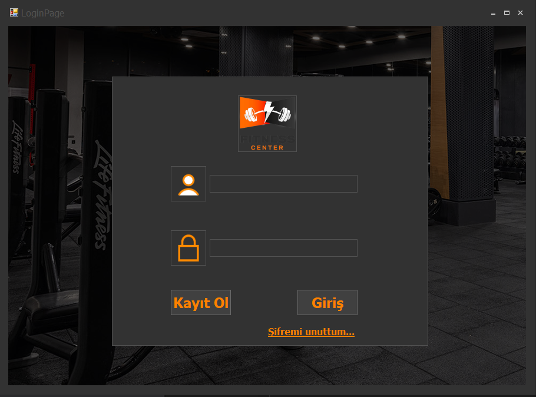
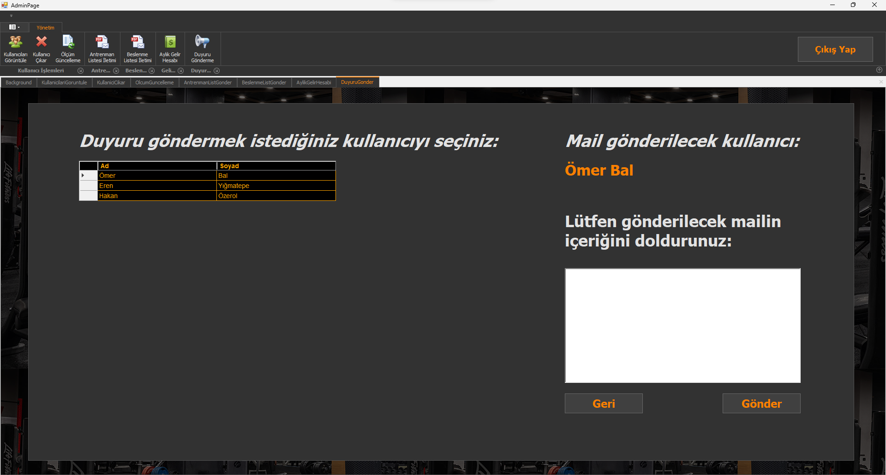
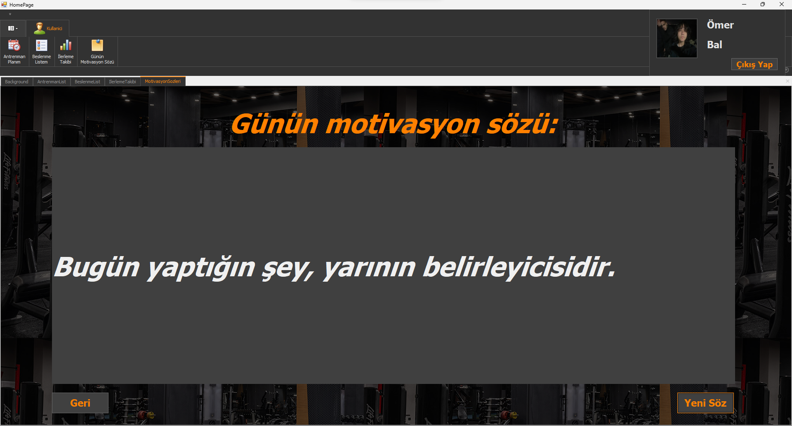

# Fitness Center Otomasyonu

## Proje Hakkında
Bu proje, spor salonlarının üyelik, gelir, antrenman ve beslenme planları gibi işlemlerini yönetmek için geliştirilen bir **otomasyon sistemidir**. 

Bu proje, [Cem Baydoğan]([https://www.linkedin.com/in/cem-baydo%C4%9Fan-7b5b5084/]) ve [Hüseyin Alperen Dağdöğen]([https://www.linkedin.com/in/h%C3%BCseyin-alperen-da%C4%9Fd%C3%B6gen-2a7b13176/]) hocalarımın yönlendirmeleri ve destekleriyle **dönem sonu projesi** olarak hazırlanmıştır.

## Proje Özellikleri
- Kullanıcı Kayıt ve Giriş Sistemi
- Üyelik Yönetimi
- Antrenman ve Beslenme Planları
- Aylık Gelir Hesaplama
- Kullanıcı İlerlemesini Takip Etme
- Duyuru Gönderimi
- Admin Paneli

## Kullanılan Teknolojiler
- **Programlama Dili:** C# (.NET Framework)
- **Veritabanı:** MSSQL
- **Arayüz:** Windows Forms
- **Kütüphaneler:** DevExpress, SMTP

## Kurulum ve Çalıştırma
- 

## Ekran Görüntüleri

Daha fazlası için Ekran Görüntüleri klasörünü inceleyebilirsiniz.

## Teşekkür
Bu projeyi yönlendiren ve destekleyen sevgili hocalarım **Cem Baydoğan** ve **Hüseyin Alperen Dağdöğen**'e sonsuz teşekkür ederim. 

## Lisans
Bu proje MIT Lisansı ile lisanslanmıştır. Daha fazla bilgi için LICENSE dosyasını inceleyebilirsiniz.
